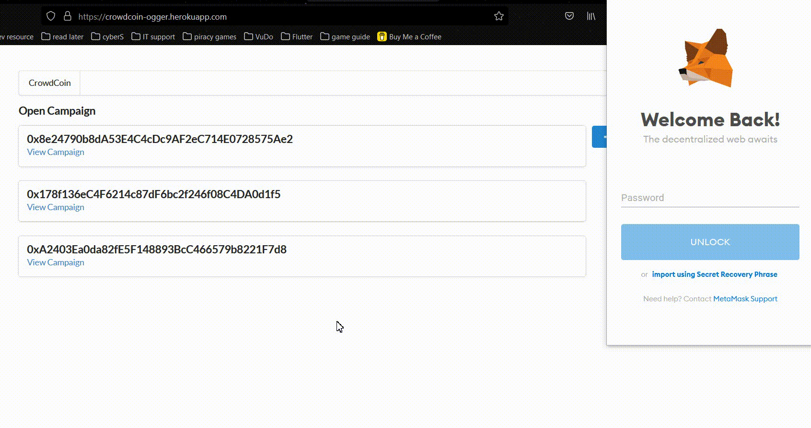
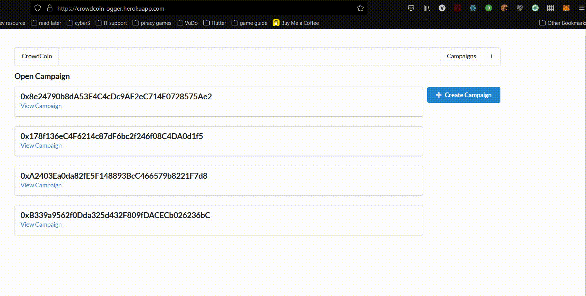

# CrowdCoin


A kickstarter web demo that using ethereum as a currency of donating money.
User can use their ether coin to donate as well as authorize the distribution of the funds.
Based on a tutorial of Stephen Grider

## Getting Started

You need [Metamask](https://metamask.io/) extendsion on your browser to interact with ethereum test network.

### Installing

Navigate to the project forlder and run:

```
npm i
```

Navigate to ethereum folder and run:

```
node compile.js
```

Copy your account abi from terminal and replace it in deploy.js and run:

```
node deploy.js
```

### Usage




## Deployment

Live demo-version is up on [Heroku](https://crowdcoin-ogger.herokuapp.com/)

## Built With

- [Next.js](https://nextjs.org/)
- [Solidity](https://soliditylang.org//)

## Authors

- **Dinh Vu** - *https://ogger77.github.io/*

## License

This project is licensed under the MIT License - see the [LICENSE.md](LICENSE.md) file for details
